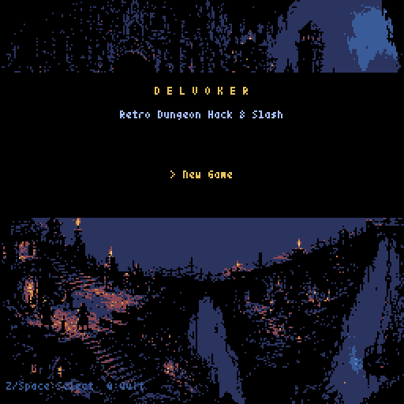
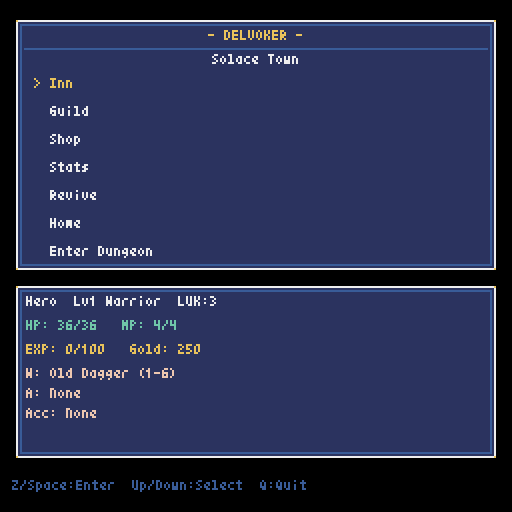
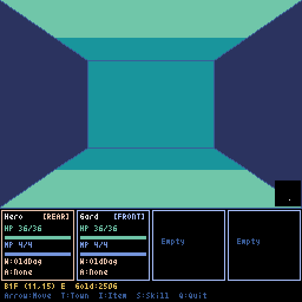
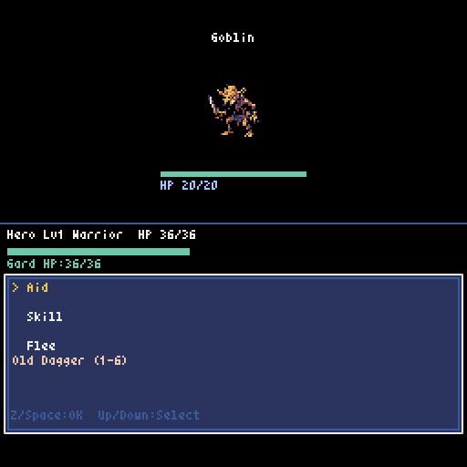

# Delvoker

[](https://github.com/gantaro-max/delvoker/actions/workflows/ci.yml)

Pyxel製のレトロスタイル・ダンジョン探索RPGです。プレイヤーはポーターとして、攻撃にも参加しつつ臨時NPCを管理・支援しながら迷宮を攻略します。

| タイトル | 街: Solace Town |
| :---: | :---: |
|  |  |
| ダンジョン探索 | 戦闘 |
|  |  |

## 特徴

- ポーター自身も攻撃に参加し、AidやEncourageで仲間を支援する戦闘。
- 性格に応じて行動する、雇用可能な臨時NPC。
- normalからgenesisまでのランダムエンチャントを含むハクスラ要素。
- 部位破壊、手続き的なダンジョン生成、鍵扉・罠・泉・商人。
- 全滅時のアイテムロストと、遺品を回収するための再挑戦。
- 詳細な仕様は[docs](docs/)内の設計資料を参照してください。

## 起動方法

Python 3.11以上、Pyxel 2.9以上が必要です。

```bash
git clone https://github.com/gantaro-max/delvoker.git
cd delvoker
pip install -r requirements.txt
python main.py
```

LinuxではSDL2関連パッケージが必要になる場合があります。開発用には必要な環境を含むVS Code Dev Containerも同梱しています。

## 操作方法

| キー | 操作 |
| --- | --- |
| Arrow keys | 移動、項目選択 |
| Z / Space | 決定 |
| X | キャンセル |
| T | ダンジョンから街へ帰還 |
| I | インベントリを開く |
| S | ダンジョン内スキル画面を開く |
| Q | 終了 |

## 開発の進め方

このプロジェクトはAIエージェントと人間の協働で開発しています。`docs/`を仕様の唯一の情報源とし、実装指示書を`docs/instructions/`に作成して、完了後に`docs/archive/`へ移します。

- Codex（メインエージェント）: 要件からの指示書作成、実装、ドキュメント同期・アーカイブ。
- Claude（レビュアー）: 実装済みコードのレビュー、リファクタリング、難しい不具合の原因究明。
- 人間: 要件提示、仕様判断、最終受け入れ。

詳細な役割とルールは[AGENTS.md](AGENTS.md)および[CLAUDE.md](CLAUDE.md)を参照してください。

## テスト

```bash
pip install -r requirements-dev.txt
pytest
```

README用スクリーンショットは、仮想ディスプレイ上で次のコマンドにより再生成できます。

```bash
Xvfb :99 -screen 0 640x480x24 &
DISPLAY=:99 python tools/capture_screenshots.py
```

## プロジェクト構成

- `main.py`: アプリケーション本体とゲーム状態の制御。
- `data.py`: キャラクター、アイテム、敵、成長のデータモデル。
- `constants.py`: 画面、状態、タイル、ゲーム定数。
- `logic/`: マップ生成などのゲームロジック。
- `systems/`: セーブデータなどのシステム機能。
- `ui/`: 3D風ダンジョン表示などのUI描画。
- `data/`: JSON形式のゲームカタログ。
- `assets/`: 制作元画像アセット。
- `docs/`: 仕様書、実装記録、スクリーンショット。
- `tests/`: Pyxel非依存部分の自動テスト。
- `tools/`: アセット変換・スクリーンショット生成ツール。

## 今後の改善

`main.py`は3,251行に肥大化し、状態ごとの`update`/`draw`が集中しています。`logic/`、`systems/`、`ui/`への分割を進めており、次の課題は状態ハンドラをモジュールへ分離することです。

BGMは`main.py`内に定義されていますが、音楽データの最終調整までミュートされています。公開後はCIが安定していることを前提に、状態ハンドラ、戦闘ロジック、各メニューの順で安全に分割します。

## ライセンス

Pythonコード、JSONゲームデータ、開発ツール、画像以外のドキュメントは[MIT License](LICENSE)で提供します。

`assets/source/`、`assets.pyxres`、ドキュメント内のPNG画像は[CC BY 4.0](LICENSE-assets.md)で提供します。素材の生成元と帰属方法は[ASSET_CREDITS.md](ASSET_CREDITS.md)を参照してください。
